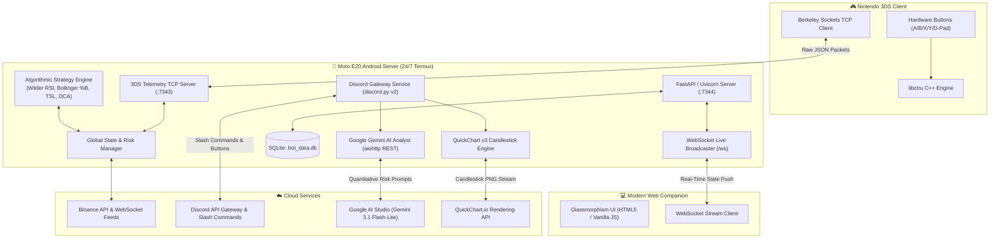

# Cripto-3DS: Master Project Summary & Architecture Blueprint

```
  ____      _       _           _____ ____  ____  
 / ___|_ __(_)_ __ | |_ ___    |___ /|  _ \/ ___| 
| |   | '__| | '_ \| __/ _ \     |_ \| | | \___ \ 
| |___| |  | | |_) | || (_) |   ___) | |_| |___) |
 \____|_|  |_| .__/ \__\___/   |____/|____/|____/ 
             |_|                                   
===================================================
Algorithmic Crypto Trading Ecosystem for Nintendo 3DS,
Low-Power Android Server, Discord Gateway, & Google AI
```

---

## 🌟 Executive Overview
**Cripto-3DS** is an end-to-end, multi-device cryptocurrency trading ecosystem that bridges retro handheld gaming hardware, low-power 24/7 edge computing, modern quantitative trading algorithms, interactive Discord bot operations, and generative artificial intelligence.

The entire backend runs 24/7 on an ultra-low power Android smartphone (**Motorola Moto E20** via Termux), drawing `< 2W` of power while managing Binance live/testnet accounts, running technical indicator algorithms (Wilder's RSI, Bollinger Bands `%B`, Trailing Stop Loss, DCA), orchestrating an interactive Discord Bot with custom action buttons and instant candlestick charts, and querying **Google AI Studio (Gemini 3.1 Flash-Lite / 2.5 Flash)** for real-time risk intelligence.

---

## 🏗️ System Architecture



---

## 🧩 Core Components

### 1. Nintendo 3DS Client (`cripto-3ds/`)
- **Technology**: C++ using `libctru` and standard Berkeley TCP Sockets.
- **Top Screen**: Real-time ticker cards (Price, 24h Change, RSI indicator, 24h High/Low, Trade Alert banners).
- **Bottom Screen (Touch)**: Portfolio breakdown, system log console, and dynamic trade confirmation prompts.
- **Hardware Controls**:
  - `D-Pad Left / Right`: Rotate watchlist pairs.
  - `A Button`: **Approve Trade** signal.
  - `B Button`: **Reject Trade** signal.
  - `X Button`: **Toggle Bot** (Start / Pause).
  - `Y Button`: **Panic Emergency Stop** (Instant freeze).
  - `START`: Clean exit to 3DS Home Menu.

### 2. 24/7 Engine & Server (`cripto-bot-engine/`)
- **Technology**: Python 3.11+ / FastAPI / `python-binance` / `aiosqlite` / `discord.py` / `aiohttp`.
- **Port `7343`**: Asynchronous raw TCP Socket server for 3DS telemetry.
- **Port `7344`**: HTTP REST API + WebSocket broadcaster (`/ws`) for the Web Companion and companion tools.
- **Port `8022`**: Termux OpenSSH daemon for remote management and code synchronization.

### 3. Glassmorphism Web Companion (`web_companion.html`)
- **Zero-Polling Architecture**: Uses reactive WebSockets to stream price updates, portfolio changes, and strategy states instantly.
- **Client-Side PIN AES-CBC Encryption**: Binance API/Secret keys and Google AI Studio keys are encrypted with the user's Auth PIN before storage.
- **Performance & PnL Dashboard**: Live realized profit/loss counter, Win Rate %, closed trades ledger, and a **`[🗑️ Clean Rejected]`** button to purge test clutter.

### 4. Interactive Discord Bot (`engine/notifier.py`)
- **Discord Gateway Connection**: Uses `discord.py` v2 with direct Guild-level command sync (instant 0-second deployment).
- **Interactive Action Cards**: Dispatches trade signal embeds with live `[✅ Approve]` and `[❌ Reject]` action buttons.
- **Slash Commands**:
  - `/status`: Real-time engine health, mode, price watchlist, and indicator values.
  - `/balance`: Net worth calculation across USDT and all held portfolio assets.
  - `/chart [pair] [interval]`: Instant dark-mode candlestick chart with 20-SMA, Bollinger Bands, and Wilder RSI.
  - `/ask [question]`: Direct conversational market analyst powered by **Google Gemini 3.1 Flash-Lite**.
  - `/cleartrades [all_trades: False]`: Clean test/rejected trades from the database straight from chat.
  - `/start`, `/pause`, `/check`, `/testbuy`.

---

## 📈 Quantitative Trading Algorithms

### 1. Wilder's 14-Period RSI (Relative Strength Index)
Smoothed exponential moving average of gains vs. losses over 14 hourly/custom periods:
$$\text{RS} = \frac{\text{Smoothed Avg Gain}}{\text{Smoothed Avg Loss}}$$
$$\text{RSI} = 100 - \left(\frac{100}{1 + \text{RS}}\right)$$
- **Trigger**: Buy signal triggered when $\text{RSI} \le 30.0$ (Oversold condition).
- **Cooldown**: Configurable cooldown window (default 24h) to avoid repetitive buy loops.

### 2. Bollinger Bands & %B
20-period Simple Moving Average (SMA) with $\pm 2$ standard deviations ($\sigma$):
$$\text{Upper} = \text{SMA}_{20} + 2\sigma, \quad \text{Lower} = \text{SMA}_{20} - 2\sigma$$
$$\%B = \frac{\text{Price} - \text{Lower}}{\text{Upper} - \text{Lower}}$$
- Evaluates volatility squeezes and oversold price penetrations below the lower band ($\%B < 0$).

### 3. Trailing Stop Loss (TSL)
- **Activation**: Activated once an asset position gains $\ge 3.0\%$ above cost basis.
- **Trailing Stop**: Continuously updates highest recorded peak price. Triggers a SELL signal if the price pulls back by $\ge 1.5\%$ from its peak.

### 4. Dynamic DCA (Dollar-Cost Averaging)
- Executes periodic, paced capital accumulation over user-configured hourly intervals while maintaining minimum reserve capital.

---

## 🤖 Google AI Studio Integration

### Models Supported
- **`gemini-3.1-flash-lite`** (Recommended / Default): Ultra-low latency, deep quantitative reasoning, 0 memory overhead.
- **`gemini-2.5-flash`** / **`gemini-2.5-flash-lite`** / **`gemini-1.5-flash`**.

### Operational Capabilities
1. **Structured Trade Risk Intelligence (`analyze_trade_signal`)**:
   - Injected into Discord trade cards and 3DS TCP telemetry.
   - Parses price action, 14-period Wilder RSI, Bollinger Bands `%B`, 5-period trajectory, and live **Crypto Fear & Greed Index** (`alternative.me`).
   - Generates typed JSON output: `verdict` (`APPROVE` / `CAUTION` / `HIGH_RISK`), `risk_score` (1–10), `confidence`, dynamic `suggested_sl_percent`, warning flags, and concise summary.
2. **Context-Aware Conversational Analyst (`/ask`)**:
   - Injects live portfolio balances, active watchlist prices, Wilder RSI, Bollinger `%B`, and macro sentiment (Fear & Greed Index) into prompt context.
   - Generates actionable, formatted quantitative market analyses in Discord chat.
3. **Hardware Telemetry Streaming (`ai_risk`, `ai_verdict`)**:
   - Streams AI risk metrics (`LOW`, `MEDIUM`, `HIGH`) and verdicts over TCP port `7343` directly to Nintendo 3DS client.
4. **Cost**: **100% Free** via Google AI Studio Free Tier (15 RPM / 1,500 requests/day).

---

## 📱 Moto E20 Hardware Deployment (Termux)

### Network & Port Map
| Service | Protocol | Port | Description |
| :--- | :--- | :--- | :--- |
| **3DS Telemetry** | Raw TCP | `7343` | 3DS Hardware Telemetry & Control |
| **Web Companion / API** | HTTP / WS | `7344` | Web UI Dashboard & WebSocket Feed |
| **Termux SSH** | SSH | `8022` | Remote Terminal & Rsync Deployment |

### Deployment Commands

#### 1. Push updates from PC / Laptop:
```bash
rsync -avz --exclude '.venv' --exclude 'bot_data.db' --exclude '__pycache__' --exclude '.pytest_cache' \
  -e "ssh -p 8022" \
  /home/andre/Desktop/Projects/Cripto-3DS/cripto-bot-engine/ \
  u0_a277@moto-e20:~/cripto-bot-engine/
```

#### 2. Auto-Start Daemon on Phone Boot (`~/.termux/boot/start-cripto.sh`):
```bash
#!/data/data/com.termux/files/usr/bin/bash
termux-wake-lock
sshd
cd ~/cripto-bot-engine
source .venv/bin/activate
HEADLESS=true python main.py >> engine.log 2>&1 &
```

#### 3. Manual Phone Management:
```bash
# Restart server
pkill -f "python main.py"
~/.termux/boot/start-cripto.sh

# View live logs
tail -f ~/cripto-bot-engine/engine.log
```

---

## 🛡️ Risk Management & Safety Limits

- **Auth PIN Gate**: All sensitive endpoints (`/api/config`, `/api/trade/decide`, `/api/trades/clear`) require `X-Auth-PIN` header validation.
- **Max Trade Cap**: Limits USDT allocation per single order.
- **Daily Spend Cap**: Hard ceiling on cumulative 24-hour trade volume.
- **Dry Powder Reserve**: Enforces a minimum untouchable USDT balance.
- **Human Confirmation Gate**: Holds trade signals in a pending queue awaiting explicit user approval via 3DS (`A` button), Web (`[Approve]`), or Discord (`[✅ Approve]`).

---

## 🧪 Test Suite & Quality Assurance

Automated test suite (`tests/test_engine.py`) covering 17 end-to-end unit and integration tests:
```bash
uv run pytest -v tests/test_engine.py
```
- ✅ `test_get_state_endpoint`: State structure & watchlist verification.
- ✅ `test_bot_toggle_active`: Pause / Resume engine logic.
- ✅ `test_simulate_trade_signal`: Signal creation & risk validation.
- ✅ `test_trade_approval_flow`: Human approval & execution lifecycle.
- ✅ `test_trade_rejection_flow`: Rejection & queue clearing.
- ✅ `test_3ds_telemetry_pin_commands`: Raw TCP 3DS socket handshake.
- ✅ `test_wilder_rsi_calculation`: Mathematical RSI precision test.
- ✅ `test_bollinger_bands_calculation`: Standard deviation & envelope tests.
- ✅ `test_format_and_validate_order`: LOT_SIZE and PRICE_FILTER exchange rules.
- ✅ `test_trailing_stop_loss`: Dynamic high-watermark trailing stops.
- ✅ `test_state_indicators`: Indicator serialization in state dict.
- ✅ `test_trade_history_and_pnl`: Realized PnL and win-rate accounting.
- ✅ `test_get_trades_endpoint`: Trade history REST API verification.
- ✅ `test_gemini_analyst_fallback`: AI key omission & fallback resilience.
- ✅ `test_chart_generator`: QuickChart v3 candlestick PNG buffer generation.
- ✅ `test_gemini_state_and_config`: AI model state and discovery schema.
- ✅ `test_clear_trade_history`: Database purge of rejected/test trades.

---

## ⚠️ Disclaimer
This software is an experimental open-source tool created for educational and personal research purposes. Cryptocurrency trading involves substantial financial risk. The authors assume no liability for financial losses.

---

*Cripto-3DS is built with precision, resilience, and clean architecture.*
