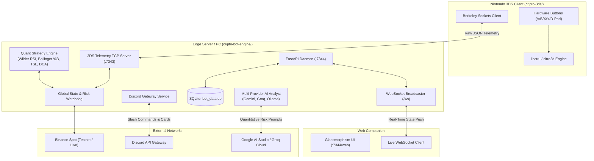

# Cripto-3DS

**Algorithmic Cryptocurrency Trading Ecosystem with Nintendo 3DS Hardware Confirmation & Low-Power Edge Server**

[](https://www.python.org/)
[](https://fastapi.tiangolo.com/)
[](tests/)
[](https://docs.astral.sh/ruff/)
[](https://devkitpro.org/)
[](LICENSE)

Cripto-3DS bridges retro gaming handheld hardware, ultra-low-power edge computing, modern quantitative algorithmic trading, and large language model risk intelligence. 

Instead of trusting automated scripts blindly with financial assets, Cripto-3DS uses a physical Nintendo 3DS console as an interactive hardware confirmation terminal over local TCP sockets. Every trade proposal generated by quantitative indicators requires a tactile physical button press (`A` to approve, `B` to reject) before executing orders on Binance.

---

## Architecture Overview



Detailed technical math, edge deployment blueprints, and data schemas are documented in [PROJECT_SUMMARY.md](PROJECT_SUMMARY.md).

---

## Core Components

- **[cripto-bot-engine/](cripto-bot-engine/)**: 24/7 asynchronous trading engine.
  - **Port 7343**: Raw asynchronous TCP socket server streaming market telemetry and receiving hardware actions from the 3DS.
  - **Port 7344**: FastAPI REST service and real-time WebSocket feed (`/ws`) powering the Web Companion.
  - **Discord Gateway**: Interactive action cards (`[Approve]`/`[Reject]`), `/chart` rendering, and `/ask` conversational risk advisor.
  - **Multi-Provider AI Risk Engine**: Supports Google Gemini, Groq, OpenAI, Anthropic, DeepSeek, and local Ollama instances for real-time risk scores.
  - **Target Environment**: Standard Linux/macOS/Windows PC or edge hardware (Motorola Moto E20 running Termux with `< 2W` power draw).
- **[cripto-3ds/](cripto-3ds/)**: Native Nintendo 3DS homebrew client built in C (`devkitARM`, `libctru`, `citro2d`).
  - **Top Screen**: Real-time crypto ticker cards (prices, 24h change, Wilder RSI, Bollinger Bands, trade alert banners).
  - **Bottom Screen**: Portfolio balances, scrollable trade logs, system diagnostics, and confirmation modals.
  - **Hardware Buttons**: Physical buttons control trade execution, bot pause/resume, and emergency kill-switch.

---

## Quick Start

### 1. Bot Engine Setup (Local PC or Server)

Requires Python 3.11+ and [`uv`](https://github.com/astral-sh/uv).

```bash
# Clone the repository
git clone https://github.com/your-username/Cripto-3DS.git
cd Cripto-3DS/cripto-bot-engine

# Sync dependencies
uv sync --all-groups

# Configure credentials
cp .env.example .env

# Optional: Run the interactive setup wizard
uv run python setup_env.py

# Start the trading engine daemon
uv run main.py
```

- **Web Companion UI**: Open [http://localhost:7344/web](http://localhost:7344/web) in your browser.
- **Run Automated Tests**:
  ```bash
  uv run pytest
  ```
- **Code Linting**:
  ```bash
  uv run ruff check .
  ```

---

### 2. Nintendo 3DS Client Setup

Pre-built binaries are provided in [cripto-3ds/](cripto-3ds/):
- **`cripto-3ds.3dsx`**: Place in `sdmc:/3ds/cripto-3ds/` for the Homebrew Launcher.
- **`cripto-3ds.cia`**: Install via FBI on custom firmware (Luma3DS).

#### Connection Setup (`sdmc:/cripto_cfg.txt`)
On first boot, the 3DS displays an on-screen keyboard to configure:
1. Engine IP address (e.g. `192.168.1.50`).
2. Telemetry port (`7343`).
3. Security PIN (matching `AUTH_PIN` in your `.env`).

Configuration is saved to `sdmc:/cripto_cfg.txt`:
```text
192.168.1.50 7343 1234 0
```
*(Press `SELECT` at any time on the 3DS to re-open the configuration wizard).*

#### 3DS Hardware Controls

| Button | Function |
| :--- | :--- |
| **D-Pad Left / Right** | Cycle active watchlist pair |
| **L / R Shoulders** | Switch bottom screen tabs (Portfolio, Trade Logs, System) |
| **A Button** | Approve pending trade / Confirm dialog |
| **B Button** | Reject pending trade / Dismiss dialog |
| **X Button** | Toggle trading engine (Pause / Resume) |
| **Y Button** | Emergency Stop (Instant freeze & order halt) |
| **SELECT** | Open connection settings wizard |
| **START** | Clean exit to 3DS Home Menu |
| **Touch Screen** | Direct touch interaction on cards, tabs, and modals |

---

## Quantitative Trading Strategies

The engine runs continuous market evaluation cycles against configured pairs:

1. **Wilder's 14-Period RSI**:
   Calculates smoothed gain-to-loss ratios over custom candle intervals. Flags oversold conditions ($\text{RSI} \le 30.0$) with configurable cooldown periods to prevent duplicate entries.
2. **Bollinger Bands & %B**:
   Calculates 20-period Simple Moving Averages with $\pm 2\sigma$ envelopes. Identifies volatility squeezes and band penetrations ($\%B < 0$).
3. **Trailing Stop Loss (TSL)**:
   Activates once an asset position achieves $\ge 3.0\%$ profit above entry cost. Tracks dynamic high-watermark peaks and issues an automatic sell signal upon a $\ge 1.5\%$ pullback from peak.
4. **Dynamic Dollar-Cost Averaging (DCA)**:
   Executes systematic, interval-based capital allocations while respecting untouchable dry-powder reserves.

---

## Safety & Security Architecture

- **Human Confirmation Gate**: No order is placed without deliberate human consent via 3DS hardware button, Web Companion, or Discord.
- **10-Minute Timeout Watchdog**: Unapproved trade proposals automatically expire after 600 seconds to prevent stale order fills.
- **Client-Side PIN Encryption**: Binance API credentials and AI keys stored via the Web Companion are encrypted client-side using AES-CBC before transmission.
- **Binance CEX Isolation**: Operates exclusively through spot API keys. Private keys and decentralized wallet seed phrases are never handled.
- **Dry Powder Reserve**: Enforces a strict minimum USDT floor balance that algorithms are barred from allocating.

---

## Project Structure

```text
Cripto-3DS/
├── cripto-3ds/                 # Native Nintendo 3DS Homebrew client
│   ├── source/                 # C source files (main, graphics, network, input, audio)
│   ├── assets/                 # Sound effects and RSF metadata
│   ├── romfs/                  # Embedded fonts and assets
│   ├── Makefile                # devkitARM build specification
│   ├── cripto-3ds.3dsx         # Pre-compiled Homebrew Launcher executable
│   ├── cripto-3ds.cia          # Pre-compiled FBI installable package
│   └── README.md               # 3DS client build and setup guide
│
├── cripto-bot-engine/          # Asynchronous Python trading daemon
│   ├── engine/                 # Core subsystems
│   │   ├── state.py            # Global runtime state & mutexes
│   │   ├── strategies.py       # RSI, Bollinger Bands, TSL, DCA math
│   │   ├── ai_analyst.py       # LangChain multi-provider AI risk evaluator
│   │   ├── notifier.py         # Discord Gateway bot & slash commands
│   │   ├── server_3ds.py       # TCP socket server for 3DS telemetry
│   │   ├── watchdogs.py        # 10-minute auto-cancel & stop-loss monitors
│   │   └── trade_execution.py  # Binance order validation & LOT_SIZE formatting
│   ├── tests/                  # Automated pytest suite (85 tests)
│   │   ├── unit/               # Strategy, AI analyst, and state tests
│   │   └── integration/        # API endpoints, telemetry, and trade lifecycles
│   ├── static/                 # Static assets for Web Companion
│   ├── web_companion.html      # Glassmorphism browser dashboard
│   ├── setup_env.py            # Interactive CLI environment setup wizard
│   ├── .env.example            # Environment variables template
│   ├── pyproject.toml          # uv project configuration and dependencies
│   ├── main.py                 # Engine entrypoint & FastAPI service
│   └── README.md               # Engine documentation & systemd guide
│
├── CONTRIBUTING.md             # Developer workflow, style guide, and testing
├── PROJECT_SUMMARY.md          # Architectural deep dive and hardware specs
├── LICENSE                     # MIT License
└── README.md                   # Repository overview
```

---

## Contributing

Contributions, bug reports, and hardware testing feedback are welcome. Please read [CONTRIBUTING.md](CONTRIBUTING.md) for environment setup, code formatting standards, and test requirements before opening a pull request.

---

## Disclaimer

This software is an experimental open-source research tool designed for educational and study purposes. Cryptocurrency trading involves substantial financial risk and market volatility. The authors and contributors assume no liability for financial losses incurred through the use of this software. Always test thoroughly using Binance Testnet before deploying real funds.
